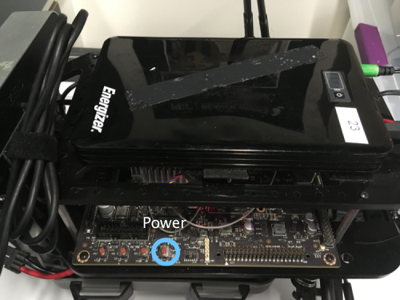

<h1>Lab: RACECAR Hardware Intro</h1>
Welcome to the RACECAR  
(**R**apid **A**utonomous **C**omplex-**E**nvironment **C**ompeting **A**ckermann-steering **R**obot)!

## Turning on the Car
1. **Use Blocko Friendo**  
Set the car on a block on your table, such that the wheels __aren't touching the table__. Unless you're actually testing your code on the ground, leave the car on this block.

2. **Plug in the Electronics Battery**  
Unplug the battery charger.

If you have an XT Power battery, there will be two identical wires; you only need to plug one into the battery. On these batteries, *quickly* press the battery's power button. If you hold it, it will change the voltage setting.

If you have an Energizer battery, there will be a wire marked blue and a wire marked green, which you must plug into the corresponding ports).  
Troubleshooting Tip: if something isn't receivng power, check to make sure that the blue and green ports inside the Energizer aren't broken apart. Each should have a center pin.

3. **Boot it Up**  
Turn on the car using the power button on the TX2. The lights should turn green.

4. **Plug in the Traxxas Battery**  
This battery can supply ample amperage to the VESC (Vedder Electronic Speed Controller) which controls the drive and steering motor.

Troubleshooting Tip: you'll know the VESC is receiving power if the steering servo motor tries to keep the front wheels steered forwards. Also, please don't apply too much force when trying to turn the front wheels to test this; it doesn't take much force to tell.

## SSH'ing
**The `ssh` command allows you to use a remote computer's (i.e. a racecar's) terminal on your host machine.**

To ssh, make sure you are connected to the same wifi network as your car.  
Then run in your terminal:
`ssh racecar@192.168.1.<YOUR_CAR_NUMBER>`.  
The RACECAR's password is racecar@mit.

Make sure everyone on your team is able to do this before moving on! 

## SCP'ing

**The `scp` command allows you to copy files back and forth from a remote machine.**  

From local to remote (i.e. upload to car):  
`scp <LOCAL_FILE_PATH> <REMOTE_USERNAME>@<IP>:<REMOTE_FILE_PATH>`  
From remote to local (i.e. download from car):  
`scp <REMOTE_USERNAME>@<IP>:<REMOTE_FILE_PATH> <LOCAL_FILE_PATH>` 

For example, if you wanted to move a file on your Mac desktop called "drive.py" to the "racecar_ws" folder of car 101, you would run:  
`scp ~/Desktop/drive.py racecar@192.168.1.101:/home/racecar/racecar_ws/` 

Troubleshooting Tip: **You should run `scp` outside of the racecar** (i.e. not in an ssh'd terminal). Otherwise, you'd be flipped around and need your computer's hostname and IP.

## Controlling the car
Once you've successfully ssh'd in, type `teleop`. This will allow us to actually drive the car. If there is an error about it being unable to connect to the joystick, end the program (ctrl-C) and try again. If there is still an error, as a TA for help. 

Now you can drive the car using the controller! The cars have a Dead Man's Switch for safety; this means that to use the controller to drive, you have to hold down LB at the same time. If the Mode light is turned on, press Mode. The controller must also be in the X mode (this is changed by a switch in between the bumpers). Try driving around! The left joystick controls speed, and the right joystick turns.

Keep in mind that these are expensive (i.e. several kilodollars!) piece of equipment; always be aware of your/the car's surroudings when driving, and communicate with other teams that are also driving their cars to avoid damaging them.

#### Common Errors
If your car doesn't drive with the controller...

* Check `teleop` for any errors. There should be a "force feedback" error for the joystick, but everything else should run fine.
* If there is a VESC error, quit `teleop`, wait a minute or two and try again. This often happens if you try to run teleop immediately after turning on the car or pluggin in the Traxxas battery, since it takes a minute for the VESC to boot up.
* If you get individual errors for the Hokuyo or IMU, check that these are properly plugged in.
    * <table>
        <tr>
            <td></td>
            <td>The IMU should be plugged into the USB hub, and its micro USB port should not be ripped off. It should light a blue LED when it's powered on.</td>
        </tr>
    </table>
    * <table>
        <tr>
            <td></td>
            <td>For the Hokuyo, check that its Ethernet cable is plugged into the USB and that it's power cable is plugged into the power harness. You'll know the Hokuyo is receiving power if you can hear it whirring.</td>
        </tr>
    </table>
* If you get multiple errors for the VESC and IMU, there might be a problem with your USB hub. Try power-cycling the car (turning it off and on). If that doesn't fix it, check that the USB hub is connected to the TX2 board and is getting power from the electronics battery through the power harness.  
Alternatively, you may also get a similar whopping load of errors if more than one person tries running `teleop` at the same time. Power cycle the car and try it again with only one person ssh-ed in (or just use the monitor and keyboard).
* If your controller was on D and then you switched it to X, try power-cycling the car.

When you think you have a good feel of the car, move on to the next section.

## Intro to autonomous driving
First, let's just program the racecar to drive forwards on its own. Open `controller.py`. Change the car's velocity in the function `drive_callback`. You can change the speed with the variable `self.cmd.drive.speed`. Start off with small values like 0.5 so you don't accidently crash!

When you want to run your code on the car, press the right bumper on the controller after `teleop` and your code are running.

Next, try having the car drive in a circle. You can change the wheel angle with the variable `self.cmd.drive.steering_angle` (the car uses radians). Explore the range of values that might work best for your car (speed, turning angle, etc).
