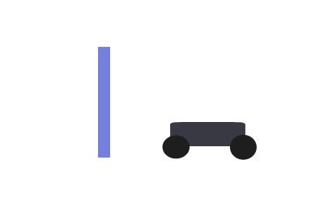

<center>
<h1>Lab: Proportional Control</h1>
Let's make the car autonomously react to its environment!
</center>
<hr/>

## Probem Statement
The racecar's goal will be to maintain a certain distance away from an object in front of it. We will use proportional control to implement this behavior.

<center>

</center>

## Idea Behind the Algorithm
A simple, non-propotional way to implement the behavior would be (pardon the pythonic pseudocode):
```
    if (distance>desired):
        motor_power(1)
    else:
        motor_power(-1)
```
This is a bang-bang controller. It would work, but not efficiently. It tries to run at constant speeds, so even if the speed is reasonable (even a tad slow) when the car is driving normally, the car would really jerk around when switches directions. (Don't believe us? Try it out.) 

So what could we do to improve this controller? We could add a greater variety of speeds:
```python
    if (distance>desired+10):
        motor_power(2)
    elif (disance>desired+5):
        motor_power(1)
    elif (distance>desired+1):
        motor_power(0.2)
    elif (distance<desired-10):
        motor_power(-2)
    elif (distance<desired-5):
        motor_power(-1)
    elif (distance<desired-1):
        motor_power(-0.2)
    else:
        motor_power(0)
```
In this model, when the car is far away, from the desired distance, it can run at a fast speed of 2, but as it gets closer to the desired distance, it slows down to 1, then 0.2, and finally switches direction at 0.

This is an improvement. But we could improve it even more by making continuous changes as opposed to these discrete bang-bang steps.<br>
**<font color="00AA00">Your goal is to make the speed directly proportional to distance away (or the "error") from the desired distance.</font>**

## Implementation
Choose a distance threshold, probably between 0.5 and 1.5 meters. Have the car aim to stay this distance away from an object in front of it. Of course, this will only allow the car to follow it in a straight line. If you have extra time, you can use this same idea to adjust the angle of the wheels so the car will stay squared to the object as it moves.

Work in `controller.py`. Instead of working in `drive_callback`, write a new function `propControl`, then publish in the callback.

If you have questions about getting distance measurements from the LIDAR, see the [Usage in ROS](http://bwsi-racecar.com/racecar-parts/lidar/#usage-in-ros) section of the LIDAR reference page.
