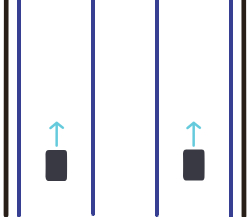
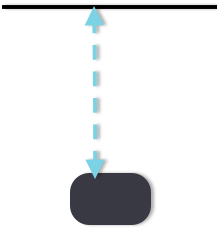

<center>
# Competitive Lab: Wall Following Drag Race
Vroom Vroom
</center>
<hr/>

## Problem Statement
It's time for your first challenge! You will navigate a racetrack using wall following. We will have two cars running simultaneously between two walls with "lanes" made of tape:
<center>

</center>
We will time each team, and if you stray outside of your lane, you will get a time penalty (the lanes are about 3 cars wide, so it won't hopefully won't be too difficult).

## Idea Behind the Algorithm 

Wall following is a fairly simple mode of autonomous navigation where your car will drive alongside a wall. There are multiple ways to do this. The simplest way would be to keep the car a certain distance from an obstacle to the side of the car (using a proportional or PID controller).
<center>

</center>
  
Another strategy is to first find what is most likely to be a wall, then use it to predict the path of the wall. You could try to do a full linear regression, but this probably isn't the most efficient method. You can also do a simple "bang-bang" method and pick two random close points that seem to represent a wall, then have the car follow the line that passes through them. 
<center>

</center>

##Implementation

Here are some tips for a successful wall follower:

* Consider slicing the ```ranges``` data into more useful pieces. A majority of the data won’t be useful to you if you only care about a wall to one side. When you can, try to use [```numpy```](https://docs.scipy.org/doc/numpy-dev/user/quickstart.html) operations rather than for loops in your code. [Multidimensional slicing](https://docs.scipy.org/doc/numpy-1.13.0/reference/arrays.indexing.html) and [broadcasting](https://docs.scipy.org/doc/numpy-1.13.0/user/basics.broadcasting.html) can make your code cleaner and much more efficient. You can turn any array into a ```numpy``` array with [```np.array```](https://docs.scipy.org/doc/numpy-1.13.0/reference/generated/numpy.array.html), or you can integrate it directly with ROS like in [this tutorial](http://wiki.ros.org/rospy_tutorials/Tutorials/numpy).
* Start off just looking for a wall on one side of the car; once this side works, implement it for the other side as well. You can map the left and right walls to different button (ex. 'A' activates the left wall follower, and 'B' activates the right wall follower). All the joystick buttons correspond to an integer in its ROS message; check the joystick callback function or run `rostopic echo vesc/joy` for hints on how to map buttons. 
* Convert LIDAR points to cartesian points to calculate their resulting line. Make a separate function to do this.
* Be warned that if your algorithm only tries to make the car parallel to the wall, the car's average distance from the wall may develop cumulative error.

__Extra Challenges__: Make the car autonomously decide which wall it should follow. You might base this off of factors like the distance or the accuracy of the predicted wall. If you also complete this, you could try to make your wall follower more robust, or try to implement a [PID](https://en.wikipedia.org/wiki/PID_controller) to make it smoother and more accurate.

To keep your code organized and efficient, we've set up empty functions for you. I recommend only using `drive_callback` to set the driving speed and angle and putting everything else in other function. If there is too much code in a callback, it will become too slow and the car won't drive smoothly.

Functions to write:

* `convertPoint`: convert polar points (points with only magnitude and angle) to cartesian coordinates
* `estimateWall`: Predict the wall using the method described above. Currently, it takes in a direction (left or right) as a parameter, but you can change this if you'd like
* `chooseWall`: Autonomously choose which wall to follow (this can be left empty if you don't get to it)

As always, start off by testing your code with the simulator before trying out the car itself.
