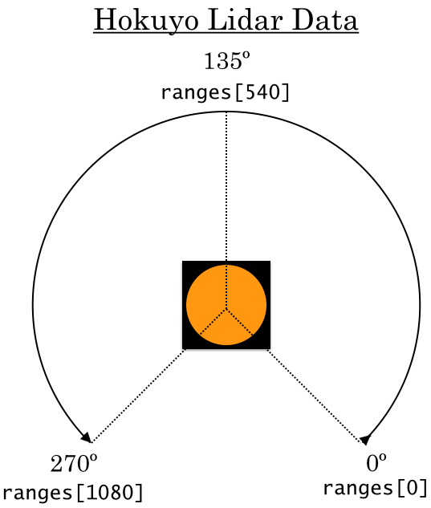

# Safety Controller 

To make sure we don't accidently break the cars, we're going to write a safety controller that will stop them from crashing. In `racecar_ws/src/`, open `safety.py`. In the function `is_safe`, make the car stop if it detects anything 0.5 meters in front of it. Otherwise, let the current drive commands continue on. Remember that the actual car's LIDAR data takes 1081 rays, so it is indexed from 0-1080. 

The subscribers and publishers are already written for you, as well as the publish statement in the drive callback, so you won't have to worry about that.

All of your code in `controller.py` (also in `racecar_ws/src/`) will go through the safety controller, so you can test your controller by driving there.

Once you have this basic safety controller implemented, you can move on to moving your potential fields solution (maybe even your wall follower) into `controller.py`, which is where you will be writing most of your code on the car. Or if you'd like, you can make your safety controller more complex; for example, you could have it slow to a stop based on its current speed, or consider other LIDAR angles.
