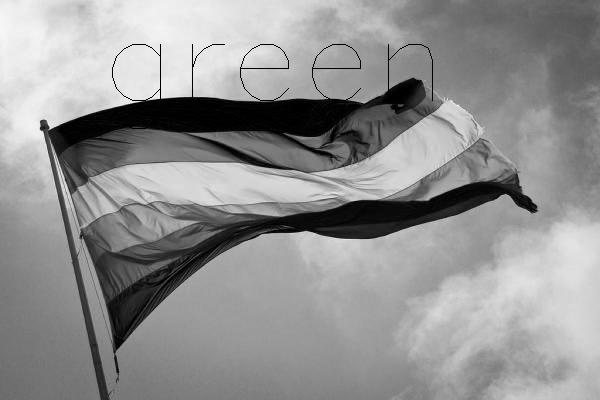
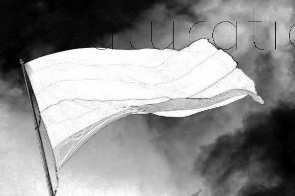
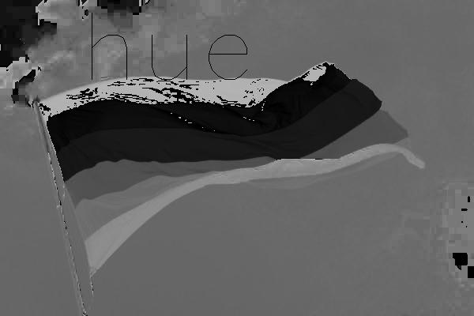

## Color Segmentation and openCV

A color space is an organization of colors typically used to encode an image. The most common color space that most people may have heard of is the RGB color space. Others include the CMYK and YIQ models, but a common color space for robotics is the HSV color space. 

HSV stands for **H**ue, **S**aturation, and **V**alue. Saturation is the intensity of the color. Hue is which one of the standard "colors" this particular color most resembles (we count starting from red to yellow, green, cyan, blue, and end with magenta). Value is the brightness of the color, where 0 is completely black and 100 is no black.

### **Goals:**
1. Accurately guess what HSV filter is being used
2. Determine the threshold values for detecting a green flag and a cone
3. Code your racecar to stop when it sees an orange cone at a desired distance away

## Part 0: Setup

You can download the files you need from this [link](https://drive.google.com/drive/folders/1sSCEJ9reKdC7XVm5K5HXhXXgpeiNO7mK?usp=sharing). You will be working mainly with *slider_colorRecognition.py*, *challenge.py*, and *driveNode.py*.

If you are not a Linux user, you will need to have openCV version 4 installed onto your laptop. To check which version you have/if you have a version all, go into terminal and type
```sh
    python
    import cv2
    cv2.__version__
```
If you have the wrong version, first uninstall opencv-python by typing ```pip uninstall opencv-python```. To install the correct version, type ```pip install opencv-python==4.1.0.25```.

You will also need to split up into two teams within your group for parts 1 and 2; when picking these sub-teams, make sure one person in each team has a working laptop camera. If no one in your team has working/good cameras, talk to your TA to see if there are extra webcameras you could borrow.

Copy the files over for this lab and put newZed.py, driveNode.py, and color_segmentation.py into the scripts folder inside racecar_ws/src **in your robot**.

## Part 1: Correctly Identify Color Filters as well as Hue, Value, and Saturation
We'll be working with your laptop only for this part of the lab. Run *challenge.py*, which will apply a random filter to this image:


**Note:** If you get an assertion error / error -215, the image pathing is wrong! Make sure challenge.py is in the same directory as your resources folder since the code calls for "resources/rainbow.jpg"

Once challenge completely executes, you can press 'z' to randomly select from components of RGB and HSV: red, blue, green; hue, saturation, value. The program will modify the image to only show the values of the component that was picked. Work with your team to figure out which image is showing which component, then click the dropdown and compare. If you got any wrong, discuss with your team and call over a TA to help clarify any questions.

<details>
<summary>Answers:</summary>
<br> 










</details>

## Part 2: Detecting Objects Using Color Segmentation
Color segmentation is an algorithm used to find specific objects. We first specify the upper and lower bounds for the components of whatever color space we are using ie. hue, saturation, value for HSV and so on. The algorithm then takes in an image and applies a filter to it that "erases" any pixel that does not fall within the specified range, allowing the camera to focus on specific objects.

**Note:** When you run slider_colorSegmentation, you must add a source flag. You do this by typing in the command to run the program normally in your terminal (python slider_colorRecognition.py) then typing -s and a source number (0 for your laptop's camera and 1 for a usb camera). For example, a person using their laptop's camera would go into their terminal and type
```sh
   python slider_colorSegmentation.py -s 0
```

* Look at your objects and make note of which component (hue, saturation, value) will be most useful for you
* Run slider_colorSegmentation.py. This gives you three separate windows, one containing the camera output, one with the filter, and one with the sliders. In order to exit the program, press and hold the escape key. If you are missing the third slider window, try looking at your open windows and selecting it.
* You will see two sliders for each component of the color space. One is the lower bound and the other is the upper bound. The area in between is the area that the algorithm will target; everything else will be excluded.
* In the first window, a green bounding box will be drawn around the largest object within the bounds you have specified.
* Figure out what the correct bounds are for each object and take notes! Try to get the most accurate filter (in other words, only the specific object you want shows up on-screen). Write down your cone hsv ranges!

**Note:** Are HSV values always constant? What things could affect what a camera sees? Make sure you think about these things and how they could affect what the robot sees.

These are the values that worked for us: 

* low\_range  = np.array( [ 0, 220, 161] ) 
* high\_range = np.array( [28, 255, 255] )

Compare, do yours look similar or different? Do yours work better?

## Part 3: Drive/Stop with Cones

Join back up with your bigger team since you are working with the car now!

In this part of the lab, we will be programming the car to stop when it sees an orange cone (Look at your teammate's clothing to check if they're wearing these colors!). We will first check the HSV values of the color we'll be using and take note of these values, then mess with *driveNode.py* to make the car stop when it sees the orange cone at a certain distance away.

* Open up *slider_colorSegmentation.py* and identify the upper and lower bounds of the HSV space necessary to identify the color of the cone you are working with. Once you have the numbers for the bounds, go into *color_segmentation.py* and add these values in the marked area. This ensures that the filter is applied to the images traveling through ROS.

Now, we will be working with *driveNode.py*, which is where the car will take in the filtered image and publish drive commands. In *color_segmentation.py*, there is a function called cd_color_segmentation(), which takes in an image, applies a filter, and finds the biggest viable object. It then draws a box around the object and returns the box's coordinates, in the form of a nested tuple
 ```( (xL,yL), (xR,yR) )```
. xL and yL are the x,y coordinates of the upper left corner of the box while xR and yR are the x,y coordinates of the bottom right corner of the box.

You will be working with two functions: size_calc() and drive().

* **size_calc() :** this function will primarily modify the class's self.box_size parameter. Using the information you have been given, find the total size/area of the box given by cd_color_segmentation(). 

* **drive() :** this function is called after size_calc() and when the racecar is not in autonomous mode. drive() tells the robot how to move and what to do when it sees the cone. Your task will be to have the robot stop **only when it is 1 meter or less away from the cone** and drive forward otherwise. You don't have to worry about publishing in this section since everything is published in the main loop (see *main()*), you just have to update the car's speed.

To test your code, have teleop, safety, and zed running. Then, in the scripts folder run driveNode.py like normal(type python driveNode.py). This should run your new driving node.

**Challenge:** Once you have completed all the parts, try making the car stop when the cone is a certain distance away **and** in the center of the robot's view!
