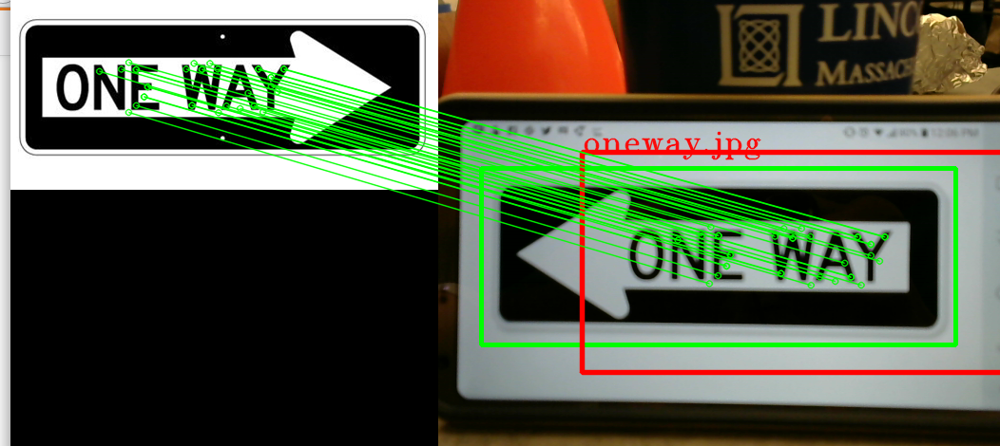

## Midweek Challenge: Cone and Sign Parking

For this week's first challenge, we'll simulate your car driving down a street, turning into a parking lot, and parking in a designated spot. Your car will have to do two things:

1. Read the direction of the sign and turn in that direction
2. Spot the orange cone and park in front of it

These two things can be developed independently of each other; our recommendation is that half of your team tackles the first task and the other tackles the second task. You can then combine the code into one file. Writing the sign recognition code will require reading some documentation, writing some openCV, and heavy on python, while the parking will deal with an extension of the drive-stop lab and state machines.

## Sign Detection
For sign detection, we will be using feature detection in the form of the ORB (Scale-Invariant Feature Transform) algorithm and color detection. This code is only designed to run on your laptop; once you can verify that it works on your laptop you can keep moving forward.

The feature detection part of the program is the ORB section; this code uses FAST to detect keypoints within the template image and compares those to the keypoints of the camera image, drawing a box around the sub-image with the most matches.

This is good and all *but* a right one-way sign does not have that many different keypoints compared to a left one-way sign, which means that ORB will not be able to tell the difference between the two signs. This is where you will have to implement an algorithm that can distinguish between the two now that you have narrowed the image to just the sign using ORB (crop the camera image to just the box around the sign). Here are two approaches:

* Template matching: Takes a template image and "slides" it over a given image, comparing the pixel values at every point. It then remembers the point with the highest match value. There are plenty of online tutorials that can show you how to write this type of algorithm.

* Pixel counting: A right one-way sign will have more white pixels in the right-most side of the sign that a left one-way sign and vice-versa. Since you have narrowed down the camera image to just the sign using ORB, you can iterate through the pixels of the sign and count the number of white pixels. There are a couple ways to do this, including converting your target image to grayscale and using the cv2.countNonZero() function.

In order for template matching to work, the sign needs to be approached at the same angle as your template image *and* traditionally has to be the same size (how can this be worked around?) while pixel counting is less consistent and could be thrown off more easily. Its up to you to implement an algorithm that fits your situation.

Here is an example run of turnRectStarter:
```bash
python turnRectStarter.py -i ./images/oneway.jpg -l "One-Way-Sign" -s 0
```

-i tells the program what image to get
-l is a lowercase l that tells what to label the detected object
-s tells them the source of camera, just like slider_colorSegmentation.py

Here is what our orb\_det returns when seeing a right way sign:


Here is what our orb\_det returns when seeing a left way sign:


### Changing turnRectStarter.py and driveNode.py to work with ROS
The images from the Zed camera and openCV images sadly do not work too well with each other. That means we will have to change some stuff so that it works with ROS. 

* First, we have to get rid of the cv2 source code inside *turnRectStarter.py* (the code that takes in images from the camera). We can delete any cv2.VideoCapture() function within the code. You can also delete any part that has the cam.read() function (including the loop it is in) and set "frame" to be a passed-in image (that means you need to alter the function to take in an extra parameter "source")

* Then, you can delete any cv2.imshow(), cam.release, cv2.destroyAllWindows(), and cv2.waitKey(), since ssh'ing does not allow these windows to pop up. You will need to delete the while loop and need to pop out all the code within the loop (ie change the indentation to be in-line with the outside code)

* Change any "continue" to a pass and comment out the parts with ap (such as ap.argparse, ap.add\_argument, etc.) Then, delete the if __main__: part of the lab (bottom two lines)

* Go to the line that has label and remove the if/else statement. Then, remove the cv2.putText() line since the robot really doesn't need that

* Finally, make a variable for your two bounding boxes, which the function will now return. Find the two instances of cv2.rectangle(), which will key you in to what the bounding box coordinates are and where they are stored, and set your bounding box variable equal to these coordinates

We will now look at driveNode.py to see how the images are passed in. Go into your __init__ function and find the self.camera_data variable. That variable holds the camera data from the Zed camera. Looking further down at the callback function, you can see that cd_color_segmentation takes in self.camera_data.cv_image. This is the Zed image that has been molded to work with openCV, so that is what you will be passing into orb\_det() as your source image. Notice that orb\_det takes in an image apart from the source(the one way sign image in this case) so make sure you pass in the location of the one-way image into the orb\_det function.

If you get confused, the implementation of the orb\_det function should be very similar to the implementation of the cd\_color\_segmentation function except for the extra "comparison" image. 


## Parking
Your task is to have the car drive up to the cone and park in front of it! You will need to build upon the code in driveNode.py since parking is just an extension of drive-stop. As you write your code, make sure you **START SMALL and SIMPLE** as a sanity check. If your simple code works, you can build up to more complicated things.

You should try to get the cone to sit between the car's wheels and have the car stop within a meter of the cone; penalties will be given for failing to satisfy these conditions.

Once you finish this, think about how your robot will respond to the sign detection. Your teammates are working on reading the sign and returning a direction; what will your robot do once that direction has been sent back? Develop the system necessary to make your robot turn in the desired direction consistently.

