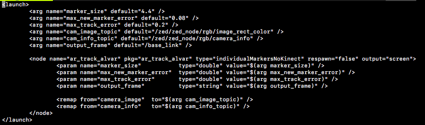

# AR Tags and Sound

Today, you will be learning to change states based off of reading AR tags and using your speakers to indicate a state change. 

### Goals
1. Implement a state machine
2. Get your car to read AR tags
3. Produce sounds when the car changes states

## AR Tags

AR tags are essentially less complex QR codes, from which our cars can read a corresponding number for each unique tag as well as the position and orientation of the tag. 

While this can be useful for localization, for now we will just be using it to change states based on which AR tag it sees. To be able to do this, we have to install a ROS package that interprets AR tags: 

* In order to install this library, you need to enter the following code into the command line (make sure you are outside of the racecar_ws for this): `sudo apt-get install ros-melodic-ar-track-alvar`. 
* Next, there are several topics you need to change in a launch file to configure the wrapper to our car. 
Navigate to the folder with all the package's launch files: `cd /opt/ros/melodic/share/ar_track_alvar/launch`. 
* Enter: `sudo cp pr2_indiv_no_kinect.launch racecar_ar.launch`. 
* Then, `sudo chmod a+rwx racecar_ar.launch` to change the read/write permissions. 
* Now, use vim to edit racecar\_ar.launch to modify the following topics (listed after default= in each line):

For "cam\_image\_topic", change it to "/zed/zed\_node/rgb/image\_rect\_color" 

For "cam\_info\_topic", change it to "/zed/zed\_node/rgb/camera\_info" 

For "output_frame", change it to "/base\_link" 

It should look like this:

* To launch the AR node, you can type `roslaunch ar_track_alvar racecar_ar.launch`. You will have to run this whenever you want to read AR tags.

While the ar\_track\_alvar node is running, whenever the car sees an AR tag with the camera, it will publish the AR tag's ID (its corresponding number) and its physical properties to `ar_pose_marker`. So, we have to write a new subscriber for this topic! The object that it will receive is of type `AlvarMarkers`. The `markers` attribute is a list of all the AR tags it sees, and the `id` attribute of each index will have the AR tag's unique number that you will need to access for this lab. For example, if you wanted the ID number of the first AR tag available and you have the callback's parameter `tags`, you could call `tags.markers[0].id`.

Now, you are going to have your car change states based on what AR tag ID it sees. You can write this in your AR tag callback. There will be six commands (for six AR tags): forwards, backwards, stop, left, right, and straight. Note that the car will detect multiple AR tags at once and has to respond accordingly. For example, if it sees both forwards and left, it should make a left turn while going forwards. You won't ever have to respond to multiple speed-related tags or turn-related tags at the same time (so you don't need to worry about seeing both a forwards and backwards tag). The AR tags IDs correspond to the following commands:

* 0: Forward
* 1: Backward
* 2: Stop
* 3: Right
* 4: Left
* 5: Straight

This time, all we're giving you in the starter code (`driveAr.py`) are the basic ROS things (publishers/subscribers, publishing, etc) and a basic framework; everything concerning the driving, reading AR tags, and setting states states is up to you. You should write everything having to do with the AR tags in the arCallback function, and set your driving speed and steering angle in the driveCallback function. Download the code [here](https://drive.google.com/drive/folders/189Vf5-P4p2II1ifWEnZYnswWQXXD_P18?usp=sharing).

## Using Sounds

We've given you speakers for your cars, so now we will be able to play sounds! This is helpful for debugging and knowing when you've changed states, since printing can sometimes slow the car down. 

After you plug in the speakers, we have to make sure the car outputs to these speakers instead of the default. In a terminal that ssh'd into your car, type in `pactl list short sinks`. One entry should have a name similar to `alsa_output.usb-Generic_USB2.0_Device_20130100ph0-00.iec958-stereo`. Copy this name and type `pactl set-default-sink name_of_your_speaker_this_is_not_the_command`. Now we have to change the volume: enter `amixer -D pulse sset Master 60%`, where the percentage is the volume (please be reasonable with the volume, we will come after you if your car is too loud).

In `driveAr.py`, you can publish the current state to the sound node using `sound_pub` (you must write the publish commands for this). Every time you change states, it should play a sound __once__.  In `soundNode.py`, there is an empty dictionary. The key will be a string with the name of the state you pass in through the publisher, and the value is a string of the path of the sound file you want to use (for example, the value for the sound file tone1 would be `"./pythonSounds/tone1.wav"`). I would recommend using left.wav and right.wav when the car turns, and different tones for the speed controls and straight.
