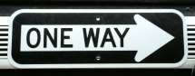
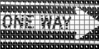
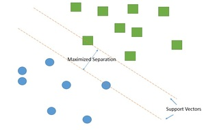
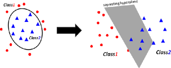
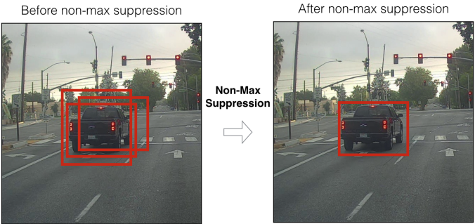

# Warning

Be sure to FIRST focus on the practice racetracks set up (if this is done during Week 4, before the Grand Final). Solely machine learning based object detection will NOT get a team through to the end. Ensure your team has a conceptual and practical plan of attack for the final course, and a backup implementation of the sign detection (we know most of you will try to detect signs with this model). 

# Histogram of Oriented Gradients (HOG)

If interested in the entire background of the algorithm, the [paper is here](http://lear.inrialpes.fr/people/triggs/pubs/Dalal-cvpr05.pdf).

This algorithm extracts key features from an image or set of images. These images are generally pre-processed to normalize lighting and shadows. It then finds features based on the most extreme gradient changes between pixels, which are then grouped into cells for an aggregate weight and direction. Intuitively, these features are strongest around the edges of objects and pixel intensity changes.

An example **HOG descriptor**:

**The original sign**

 

**The computed descriptor**



# Support Vector Machines (SVM)

This is a **supervised machine learning** method, depending on labeled training data. Based on the provided data, an SVM tries to find an optimal hyperplane (based on user parameters) to separate data points into unique classes. Optimal, in this case, is defined by separating clusters of data while maximizing the distance from those points - known as maximizing the `margin` of the training data. The hyperplane is built in N-dimensional space, and our model will be staged in 2-D or 3-D space, depending on parameters.

A classic **linear** SVM:



A **nonlinear separable** SVM, when taken to a higher dimension:



# HOG-SVM Interaction

The data points are feature vectors in our case. The feature vectors built by the HOG are fed into the SVM, where they are separated into classes of feature vectors.

***More to come.***

# Directory Setup

Download this zip file [here on Google Drive](https://drive.google.com/drive/folders/1nYBKs9f-GPLYbjyUQ_5N842WaqQleNei?usp=sharing) onto your computer.

After a full setup, your folder directory should look like this:

```bash
| - hog-svm
    |-TrainHOG.cpp
    |-detector.py
    |-batchRename.py
    |-feedSaver.py
    |-howToBuild.txt
    |-makefile
    |-positiveTrainingImages
        |-[your images]
    |-negativeTrainingImages
        |-[your images]
    |-processedPosTrainingImages
        |-[cropped and renamed posImages]
    |-processedNegTrainingImages
        |-[cropped and renamed negImages]  
```

You must make the **positiveTrainingImages** / **negativeTrainingImages** directories yourself.


# How to Use

### Collecting data

We recommend having at least 100 postives images of your object (for example, a Right Way Sign), and at least 100 negative images. A good rule is to always have at least as many negative images as positive images.

- **Positive images** : Consists of your object of interest as the center of attention. 
                    Crop and adjust the images to focus on your object, where the image essentially acts as a Region of Interest (ROI) in which the HOG algorithm will build a feature vector from. Be careful of the object's degree of rotation. HOG works when descriptors have the same "ratio". For example, a right way sign may have a 3:1 ratio of length to width, but when greatly rotated about the y-axis, the area the sign appears in what would be a square, 1:1.

- **Negative images** : Images that do not contain your object of interest. 
                    A rule of thumb is to not choose purely random pictures as negatives, but images that represent backgrounds/environments in which the model will or may be used in.

Provided are two simple helper Python scripts for image preprocessing (commands to run are found near the top of the files):

- **batchRename.py** : Copies, then renames and resizes all images within a given directory, saving these new images in a separate directory.

- **feedSaver.py** : Using a camera feed, it saves a specified number of frames from the feed as images, within a specified directory. 
                    Use the letter `e` key to start saving frames from the feed, and `ESC` to quit the stream.
                    By default saves the images as .png, but can be changed to other image formats (ex. **.jpg**).

### Choosing ML parameters

For both the Histogram of Oriented Gradients (HOG) and Support Vector Machine (SVM), there are several parameters to be chosen to optimize your integrated model.

For HOG (line 131, parameter in `hog.compute()`, in **TrainHOG.cpp**):

```text
    winstride : Window stride, a tuple of two values, determines the step size of the sliding window. 
                Intuitively, a sliding window is a rectangular region of interest (of set length and width) that moves across an image (akin to a convolutional neural network). T
                The window grabs feature vectors, passes them to our SVM model for classification. 

    padding   : A tuple of two values. Determines how many pixels are added to the Region of Interest (ROI) BEFORE feature extraction. 
                Can increase detector accuracy, but if the value is too large, will cause a performance hit.
```

Full documentation is [here](https://docs.opencv.org/3.0-beta/modules/ml/doc/support_vector_machines.html).
More info on SVM types [here](http://www.statsoft.com/textbook/support-vector-machines), useful for the `SVM-Type` parameter.
For SVM - main parameters (starting line 387, parameter in `SVM()`, in **TrainHOG.cpp**):

```text
    gamma       : Manipulates the data in 3-D space, making it easier to separate the data non-linearly, at the cost of data distortion as gamma grows.

    kernel Type : Determines the Kernel function used for separating classes. The key methods are linear vs. nonlinear seperation, depending on the datasets.   

    C           : Determines the degree of leninence for misclassification of classes in the model. The higher the C value, the more the model will try to not misclassify the HOG feature vectors.                  

    SVM Type    : Determines whether the SVM focuses on classification error minimization vs. regression error minimization.  
```


Full documentation [here](https://docs.opencv.org/master/d5/d33/structcv_1_1HOGDescriptor.html#a9c7a0b2aa72cf39b4b32b3eddea78203)
For model detection (line 113, parameter in `HOGDescriptor.detectMultiscale()`, in **detector.py**):

```text
    winstride      : See above for basic description. For real-time detection, this HEAVILY affects performance. 
                     Small strides such as (2,2) will be much slower than (4,4), as more windows to evaluate become computationally expensive. 
                     We recommend starting at (4,4) or (8,8) and adjusting for speed vs. accuracy.

    padding        : See above.

    scale          : Determines the number of layers within the image pyramid. 
                     An image pyramid represents the downsamples of the original image into smaller resultants, and detection is done at each level. 
                     This HEAVILY impacts the speed of the detector. The smaller the value of scale, the more layers are added to the image pyramid - increasing computation time.

    finalThreshold : This sets a lower bound for detection rectangle clusters. 
                     A cluster of rectangles must have ONE more rectangle than the number set by finalThreshold to be drawn. 
                     For example, if finalThreshold = 1, then clusters of at least 2 rectangles are drawn.
```

### Training data
 
Once there is a positive and negative dataset formatted, we can compile our model via the single C++ file - TrainHOG.cpp.
Compilation is more complicated Windows, requiring separate software from Microsoft called `MSVC` (an IDE). We recommend group members with Mac OS X and Native Linux machines to compile the C++ code. Check if the machines have `g++` installed, though most machines have it by default.

#### MAC OS and Linux

If `g++` is not installed:

    $ sudo apt-get update

    then

    $ sudo apt install g++

#### Windows

For training on Windows (if no members use Mac OS or Linux):

1. `scp` your **hog-svm** folder over to the racecar.

2. `ssh` into the racecar (we compile on the car as it has `g++`). 

3. Follow the instructions below (starting with `make`), and if a **Gtk-WARNING **: cannot open display**** error appears:

    - Download the **windows** folder from the Google Drive link provided above.

    - **windows** contains one file
        - **TrainHOGWin.cpp**

    - Delete the current **TrainHOG.cpp**, replace it with **TrainHOGWin.cpp**, then rename it to **TrainHOG.cpp**. 

Alternatively:

1. Connect a monitor to the racecar, and train natively with the instructions below.

#### All Operating Systems

We have provided a **makefile** to simplify the commands for object file linking and executable construction, so to use the C++ code, in your terminal:

```bash
    1. Type `make` in the directory containing the `makefile`.

    2. Type `./TrainHOG` to see what flags are available and how to run your executable. The `./` is how C++ executable files are run.
       An example of a command would be 

            $ ./TrainHOG -dw=160 -dh=80 -pd=./posImages -nd=./negImages -fn="TrafficDet160x80.xml" -v True

    3. The output file will be your model, in XML format. This will be loaded into `detector.py` for use with Python.
```

### Does the detector work?

If testing on personal machines first, there is sanity check for whether the model is trained correctly. When the detector cannot find the object, the feed will be slow and have noticeable lag. The moment the object is detected, the feed becomes much smoother and FPS improves.


### Using the detector

This final component requires a student implementation of a **non-maximum suppression algorithm** (NMS). 

-   If you were to run the detector with all bounding boxes drawn, the screen would be filled with boxes (to see: in **detector.py**, draw rectangles immediately after `detector.detectMultiscale()`. By literal definition, the algorithm seeks to "suppress" all false positive bounding boxes. We want to draw a final bounding box on areas with the most `hits`, where multiple bounding boxes overlap.



Provided in **detector.py** are two implementations, almost usable but not quite.

1. The first one is coordinate and area based (`point_non_max_suppression()`). Since `HOGDescriptor.detectMultiscale()` returns both bounding boxes and detection scores (`weights`) for those boxes, we can alter the function to take weights into account, at higher precedence than area. We recommend printing out the `weights` variable to discern score differences between boxes that detect the object, and those that do not. 

2. The second is OpenCV's Deep Neural Network implementation of NMS. The key area of focus is how the `weights` from our model relate to the **score_threshold** and **nms_threshold**. This function, `cv2.dnn.NMSBoxes()`, is generally used with convolutional neural network models (CNNs) such as **YOLO**. The threshold parameters of this function only draw boxes that are above in value. Full documentation [here](https://docs.opencv.org/master/d6/d0f/group__dnn.html).

### Multi-object detection

There are two options (Labels for objects can be returned via dictionary keyed to each detector):

1. Run two `HOGDescriptor()` objects, each one with a different XML model. Computationally expensive, but with detection parameter adjustment and CUDA GPU acceleration (already implemented), resultant speed should suffice for max two objects.

2. (Not Recommended within scope) Alter the C++ code. Train a `HOGDescriptor()` for each object. Push each `HOGDescriptor()` into a `Mat` (n-dimensional array), and push a corresponding label for each `HOGDescriptor()` into a separate `Mat`. The `labels` Mat is already created, and each label should be an `int` ID. Train a multiclass `SVM()` on these two `Mat` arrays.


Depending on student progress, we **MAY** release a fully functioning model and the correct NMS algorithm.
