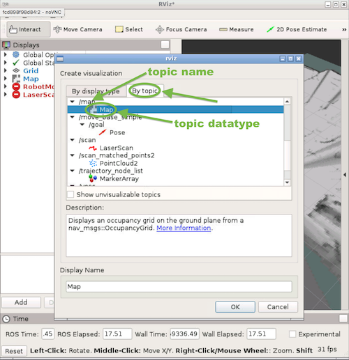

<center><h1>Google Cartographer</h1></center>
<hr/>

<!-- --------------------INSTALLING CARTOGRAPHER-------------------- -->
<details>
<summary> <h2 id="installation-instructions"> Installation Instructions </h2> </summary>

<h3> New Installation Instructions </h3>
<ol type="1">
<li>Download this zip file <a href="https://drive.google.com/file/d/1SurM5VlkNsGCOTyt9Qm-RvwhOG2SR-ac/">here on Google Drive</a> onto your computer and extract its contents. Then use <code>scp</code> to dump it onto the car into the car's Downloads:
```bash
  scp -r <path_to_my_computers_downloads_folder>/racecar_cartographer_installation racecar@192.168.1.<car_number>:~/Downloads/
```
</li>
<li>Make sure your car's router is plugged into wifi.</li>
<li><code>ssh</code> into the car <code>cd</code> to the "racecar_cartographer_installation" folder</li>
<li>Run the first shell script. (This replaces "Install Google Cartographer"):
```bash
  bash cartographer_install.sh
```
Warning: this will take a long time ~ roughly 20-30 minutes.</li>
<li>Run the second shell script. (This replaces "Install MIT Racecar stuff"):
```bash
  bash racecar_cartographer_install.sh
```
</li>
</ol>

<h3> Old Installation Instructions </h3>
<h4> Install Google Cartographer </h4>
Based on official Google Cartographer [instructions](https://google-cartographer-ros.readthedocs.io/en/latest/compilation.html):
```bash
# Update apt-get (good housekeeping)
sudo apt-get update
# Install ninja
sudo apt-get install ninja-build python-wstool python-rosdep

# Make a workspace for cartographer
mkdir ~/cartographer_ws
cd ~/cartographer_ws
wstool init src

# Fetch cartographer_ros
wstool merge -t src https://raw.githubusercontent.com/googlecartographer/cartographer_ros/master/cartographer_ros.rosinstall
wstool update -t src

# Install proto3
src/cartographer/scripts/install_proto3.sh

# Remove deb dependencies and reinitialize them
sudo rm /etc/ros/rosdep/sources.list.d/20-default.list
sudo rosdep init
rosdep update
# Must run from within "cartographer_ws" folder:
rosdep install --from-paths src --ignore-src --rosdistro=${ROS_DISTRO} -y

# Build and install. Must run from within "cartographer_ws" folder:
catkin_make_isolated --install --use-ninja
```

Then add these lines to the end of the car's "~/.bashrc" file if they're not already there:
```bash
source ~/racecar_ws/.catkin_ws/devel/setup.bash
source ~/cartographer_ws/install_isolated/setup.bash
``` 
<!--Recommendation for future work. Put these bash customization lines in ~/racecar_ws/.dotfiles/_racecars instead.-->

<h3> Install MIT Racecar stuff </h3>

Clone this repo into your "racecar_ws" (not your "cartographer_ws"!) and <code>catkin_make</code>:
```bash
cd ~/racecar_ws/.catkin_ws/src
git clone https://github.com/mit-rss/cartographer_config.git
cd ~/racecar_ws/.catkin_ws
catkin_make
source devel/setup.bash
```
Then download this zip file <a href="https://drive.google.com/file/d/1a71YjMlLNQapo6Cs3l7ezS-TKVErK0Gs/">here on Google Drive</a> onto your computer and extract its contents. Then use <code>scp</code> to dump it onto the car into someplace logical (like the Downloads folder):
```bash
  scp -r <path_to_my_computers_downloads_folder>/racecar_cartographer_files racecar@192.168.1.<car_number>:~/Downloads/
```
Then on the racecar, <code>cd</code> into the resulting "racecar_cartographer_files" folder, and copy the files over into the following paths within "cartographer_ws":
```bash
cp ./racecar_config_files/racecar_2d.lua ~/cartographer_ws/src/cartographer_ros/cartographer_ros/configuration_files/racecar_2d.lua
cp ./racecar_config_files/racecar_2d_localization.lua ~/cartographer_ws/src/cartographer_ros/cartographer_ros/configuration_files/racecar_2d_localization.lua
cp ./racecar_launch_files/racecar_2d.launch ~/cartographer_ws/src/cartographer_ros/cartographer_ros/launch/racecar_2d.launch
cp ./racecar_launch_files/offline_racecar_2d.launch ~/cartographer_ws/src/cartographer_ros/cartographer_ros/launch/offline_racecar_2d.launch
cp ./racecar_launch_files/demo_racecar_2d_localization.launch ~/cartographer_ws/src/cartographer_ros/cartographer_ros/launch/demo_racecar_2d_localization.launch
cp -r racecar_description ~/cartographer_ws/src/
```
Finally <code>catkin_make</code> again to install these files:
```bash
cd ~/cartographer_ws
catkin_make_isolated --install --use-ninja
```
</details>
<!-- --------------------USING CARTOGRAPHER-------------------- -->
<hr/>
<h2> Using Cartographer with ROS </h2>
*Note: These instructions assume you have installed Google Cartographer according to the above installation instructions.*
<hr/>

### Making a Map from Live Data

1. If you haven't already, make a folder to store maps. We recommend making it in the home directory `mkdir ~/mapfiles`.
2. Run `teleop`.
4. In another car's terminal, run `source ~/cartographer_ws/devel_isolated/setup.bash`, then `roslaunch cartographer_ros racecar_2d.launch` to start making the map.<br>

* If you forget to source the setup file, you will get an error like: "No such file or directory: /home/racecar/cartographer_ws/install_isolated/share/racecar_description/urdf/racecar.xacro..."
* If you get another error along the lines of "RLException: [racecar_2d.launch] is neither a launch file in package [cartographer_ros] nor is [cartographer_ros] a launch file name", try `cd`-ing into "~/cartographer_ws" and running `catkin_make_isolated --install --use-ninja`.

5. Run `rviz`, and add the "\map" topic if it's not there already. 
  - Do this in Docker (make sure you ran it with the car number argument), or on your Ubuntu machine (with ROS installed), or on the car itself (if you have a monitor).
  - If you are making a map with a rosbag, be warned that you will not see any map until you start playing the rosbag.
  - To add a topic, click the "Add" button.<br>
<br>
Then go to the, "By Topic" tab, and add the topic you are interested in.<br>
<br>
  - Also, rviz can be finicky at times. If nothing appears even after running teleop or playing the rosbag, try changing the "Fixed Frame" to "map". Then check and uncheck the the checkboxes for the topics you are interested in. If that didn't work, try re-running Rviz. Check that you are running the programs you need to run.
6. Drive the car around the area you wish to map out. Try to drive in closed loops when possible.
7. When you are satisfied with your map, keep cartographer running. To save the map, run `rosrun map_server map_saver -f ~/mapfiles/<your_map_name>`
8. Now you may kill cartographer.

<hr/>

### Making a Map from a Rosbag

<font color="A0A0A0">*Rosbags are nice in that they allow you to isolate data collection from data processing.*</font>

#### Recording the Rosbag.

1. If you haven't already, make a folder to store rosbags. We recommend making it in the home directory `mkdir ~/bagfiles`.
2. Place the car in a good starting position.
3. In a car's terminal, run `teleop`.
4. `cd` into your rosbag folder and run `rosbag record -a -o <your_rosbag_name>` to start recording data on all the topics.
5. Drive the car around the area you wish to map out. Try to drive in closed loops when possible.
6. When you are satisfied with your data collection (try to shoot for a minute or two of good data), kill the rosbag to stop recording. It may take a few seconds to stop, so let it die in peace.
7. (optional) The bagfile naming system is kinda gross. Use an `mv` command to rename your bag file to something pretty. If you don't know what we mean by that, [Google](https://www.google.com/) (and by that I mean [DuckDuckGo](https://duckduckgo.com/) or [Ecosia](https://www.ecosia.org/)) "renaming files in terminal".

#### Creating the Map
<u>To get a .pgm file and a .yaml file</u> (*this is what our particle filter uses*):

* Follow the same instructions as for running off of live data, but:
    * in step 2, instead of running `teleop`, run `roscore`
    * in step 6, instead of driving the car around, run 
```bash
  rosbag play ~/bagfiles/<your_rosbag_name>.bag
```
* Save the map when the rosbag stops playing. (You'll know it is done when it prints "Done." in the terminal).
* Note: Remember to kill teleop! If you don't kill teleop, cartographer will see the rosbag data and current data at the same time! Plus, since the `-a` flag passed to `rosbag record` means record everything, playing the rosbag plays drive command data!
* Possible improvements for future TA's and students to explore: bag files take up a lot of memory; figure out which topics Cartographer uses and pass them as specific arguments to `rosbag record`. See [rosbag documentation](http://wiki.ros.org/rosbag/Commandline) for details.

<details><summary><u>Alternatively, to get a .pbstream file</u> (<i>not recommended; this is usually for further use within Google Cartographer</i>):</summary>
1. Run <code>roslaunch cartographer_ros offline_racecar_2d.launch bag_filenames:=${HOME}/bagfiles/&lt;your_rosbag_name&gt;.bag</code><br>
&ensp; Warning: this will pull up an rviz window. If you're ssh-ed in, then whoops.<br>
2. Wait for the bag to finish playing, then watch the terminal and wait until it's done "optimizing".
</details>
