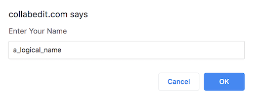
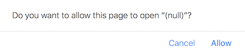
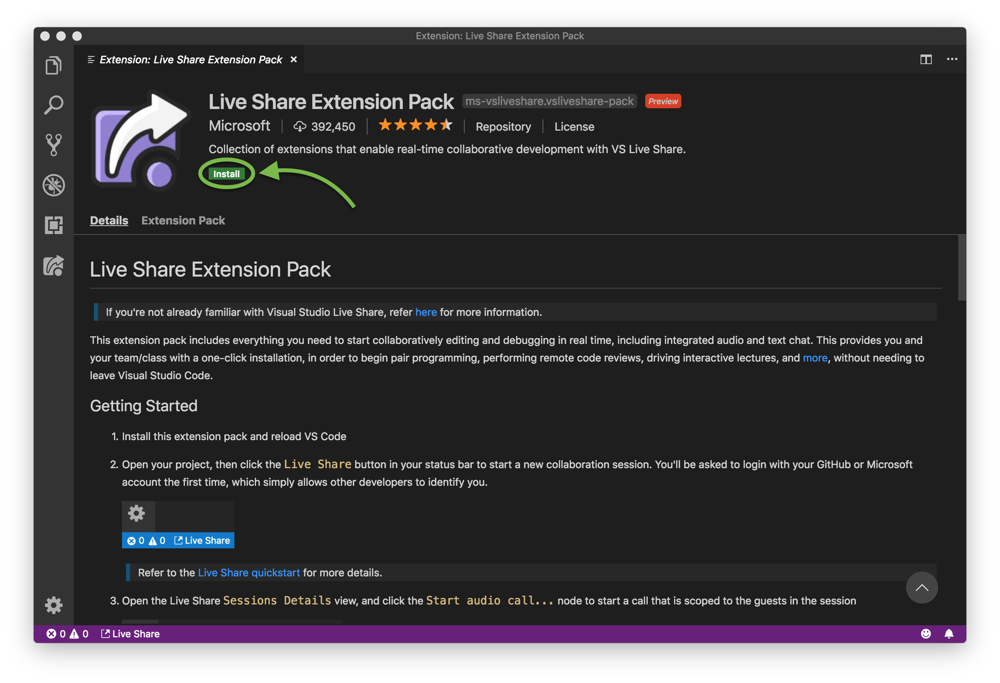
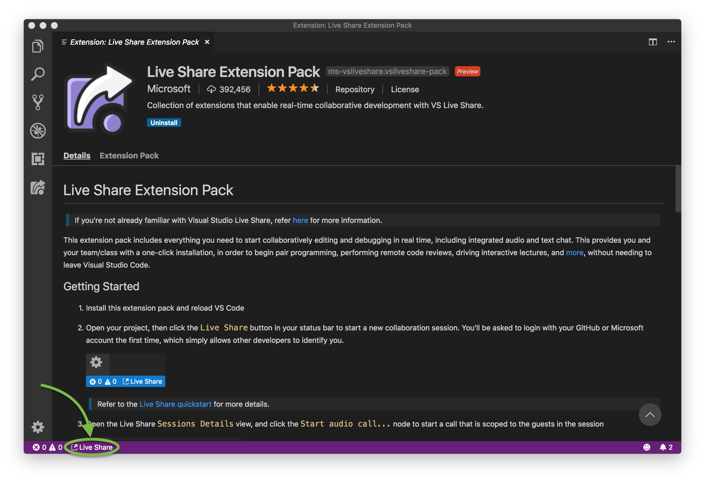
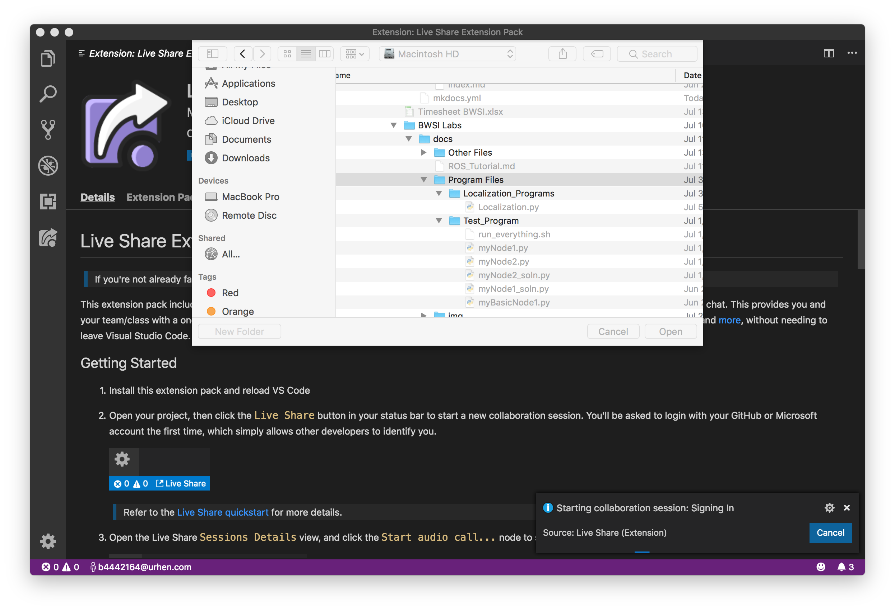
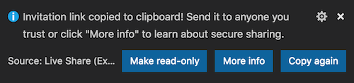
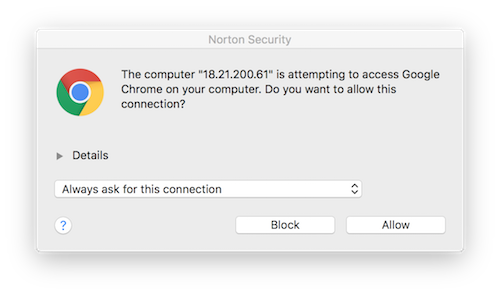

<h1>Working on Code Together!</h1>

*How can multiple people contribute to the same program?*

## Option 1: Sketchy Website

Advantages: très easy to use   
Disadvantages: manual saving, kinda sketchy

### Host Instructions

1. Go to [collabedit.com](http://collabedit.com/).
2. Click "Create a New Document".
3. Enter a logical name.  

4. Select Python as your Programming Language.
5. Share the url with your collaborators.
6.  **Remember to copy your code to your host machine every time you want to save!** 

### Collaborator (everybody else) Instructions

1. Get the url from your host.
2. Enter a logical name.
3.  **Remember to copy your code to your host machine every time you want to save!** 

## Option 2: Bloated Piece of Software

Advantages: saves directly to local machine files (for the host, at least), looks fancy  
Disadvantages: gross and cluttered interface, confusing networking, becoming a minion of the Microsoft empire 

### Instructions for Everybody

1. Download, install, and run [Visual Studio Code](https://visualstudio.microsoft.com) if you haven’t already.
2. Download/install/whatever the [Live Share](https://marketplace.visualstudio.com/items?itemName=MS-vsliveshare.vsliveshare-pack) extension pack
	1. If you don’t already have a Microsoft or GitHub account that you don’t mind being spammed, create a garbage account with a garbage email. Save the username and password.
	2. If prompted, click "allow".  
	
3. VSCode should pop up. Click "install".  

### Host Instructions
*Note: In this configuration, the host will be responsible for storing files and running them on the car.*

1. On the bottom tab thing, click "Live Share".  

2. If necessary, sign in with your Microsoft or Git account.
3. When prompted, select the folder that holds your programs.  
This is like mounting, so you can edit the files on your host machine with another editor!

4. Quickly! Before the popup goes away, copy the share link to your clipboard.
  
If you do miss it, you can get it again from:  
  
5. Send the link to your collaborators.
6. If something pops up, click "allow". It’s *probably* your collaborators. 

### Collaborator Instructions

1. Click on the link your host sent. Hope something pops ups.
2. If you want to save the code on your machine, you may need to do a manual copy-paste.
3. Let us know if you figure out how to do something fancier!

## Option 3: DIY

 **Whatever you do, you must be able to get all team members up and running such that they can see and edit code.**   
Let us know if you have something really good.
