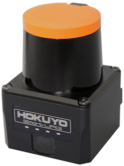
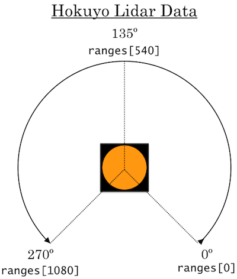
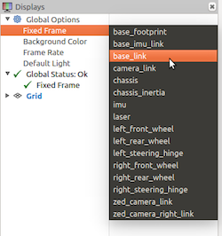
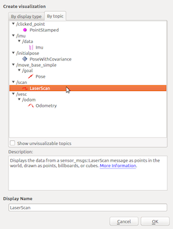

# LIDAR Sensor
## Hardware
A LIDAR sensor is a distance sensor that spins around.  
Our particular sensor is the  **Hokuyo UST-10LX** scanning laser rangefinder.

<center>
  


</center>

<details><summary> Specs </summary>
<ul>
<li> Wiring <ul>
  <li> Sends data over ethernet </li>
  <li> Requires external power </li></ul></li>
<li> Data <UL>
  <li> Detection range: 0.06 m to about 10 m </li>
  <li> Detection accuracy: +- 40 mm </li>
  <li> Scan angle range: 270° </li>
  <li> Scan angle resolution: 1081 steps (≈ 0.25° increment between distance measurements) </li>
  <li> Scan speed: 25 ms (40 Hz) </li></ul>
</ul>
</details><br>
*This sensor has an MSRP of* **1.6 US kilodollars**. *Be aware of this as you conduct your testing.*  

## Usage in ROS
* We've already programmed the car to make a node that gets the LIDAR data and publishes it via messages to the `/scan` topic.
* Each message is of the type `LaserScan`.
* The actual scan data lies in the message's `ranges` <a href="#" data-toggle="tooltip" title="a variable that belongs to that message">attribute</a>, which contains a list of all the distances (in meters) the LIDAR measured during one scan.
  - <details><summary> Other `LaserScan` message attributes </summary> <p>

    - Some notable ones include <a href="#" data-toggle="tooltip" title="the exact same specs as mentioned above;  the angular ones are in radians">`angle_increment`, `angle_max`,`angle_min`, `range_max`, `range_min`,`scan_time`</a>, and <a href="#" data-toggle="tooltip" title="a list like ranges, but where the list elements measure the intensity of the light received (i.e. how reflective the scanned object is)">`intensities`</a>.  
    - For a full list, see: <a href=http://docs.ros.org/api/sensor_msgs/html/msg/LaserScan.html>ros.org</a> 
    </p>
    </details> 
* See the diagram to figure out the angles at which the distances are measured:
<center>



</center>

<font color=#FFA0A0><b>How to visualize the data onscreen.</b></font>
<ol type="1">
<li>In the car’s terminal (ssh in if necessary), run `teleop`.</li>
<li>In the computer’s terminal (or car’s if you have a monitor plugged in), run `rviz`.</li>
<li>In rviz, select "base_link" from the "frame" dropdown menu.</li>



<li>In rviz, press "add". </li>
<li>In the popup, go to the "By topic" tab and select "LaserScan" from the "\scan" topic.</li>



<li>Hit the "ok" and enjoy! </li>
</ol>
<br>

### Important code snippets:

```python
#imports the dataype/class LaserScan
from sensor_msgs.msg import LaserScan
```
```python
#a /scan topic subscriber
laser_sub = rospy.Subscriber("/scan", LaserScan, self.laser_callback, queue_size=1)
```
```python
#a callback function for the subscriber
def laser_callback(scan_data):
  print(scan_data.ranges)
```
*<font color="A0A0A0">If you're working inside another class, try using ```self.laser_sub = ...``` and ```def laser_callback(self, scan_data): ...``` instead.</font>*
