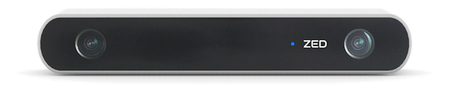

# Camera Sensor
## Hardware
Each car has a **ZED stereo camera**. It can output a standard video stream, or it can output a depth estimate stream.

Specs 

<ul>
<li> Wiring: <ul>
  <li> Sends data and receives power via USB </li> </ul>
<li> Data: <ul>
  <li> Frames per second & resolution: 60fps @ 720p </li>
  <li> Field of view: 110° </li>
  <li> Depth range: 0.5 - 20 m </li>
  <li> Can calculate <a href="#" data-toggle="tooltip" title="changes in position/rotation">odometry</a> based on visual data </li> </ul>
</ul>

*This sensor has an MSRP of* **0.5 US kilodollars**. *Be aware of this as you conduct your testing.*

## Usage in ROS

<ul>
<li>To use the ZED's data in ROS, first <a href="#" data-toggle="tooltip" title="(this initializes camera-related nodes; see “ROS: Running nodes” page for details)">run `startZED` on the car's terminal</a>.</li>

<li>Beyond that, you usually will not have to interact with ZED data directly. Rather, we will often give you programs that process the ZED’s data. 

For instance, in <a href="https://github.mit.edu/2019-BWSI/Writeups/blob/master/week2/day2/zed.py"/> ZED.py </a>, the “image_converter” class takes in the raw data and converts it to CV2 format, which helps us greatly <a href="#" data-toggle="tooltip" title="with color segmentation, for instance">to process the image.</a></li>

<li> 

 For the curious though, we can get ZED data like we get other sensor data
 
<ul>
<li> The ZED nodes publish different data to different topics. There are left/right camera topics and a depth topic. We often use `/zed/rgb/image_rect_color` .</li>
<li> Each message is of the type `Image`.
<li> For a full list of `Image` message attributes, see <a href=http://docs.ros.org/api/sensor_msgs/html/msg/Image.html>ros.org</a>.</li>
</ul>
</li>
</ul>
  

<b>How to visualize the data onscreen.</b>

<ul> 
<li>If you're ssh-ed into the car:<ol type="1">
  <li> on the car's terminal  (i.e. ssh-in), run `startZED` </li>
  <li> on the computer's terminal, run `rqt_image_view`</li> 
  <li> select the topic you would like to view </li> </ol> </li>

<li>If you have a monitor directly plugged in:<ol type="1">
  <li> Run `startZEDviz` in the terminal for a totally awesome visualization in RVIZ. </li>
  <li> Be sure to click on "DepthCloud" for the full effect.</li></ol></li></ul>

 
